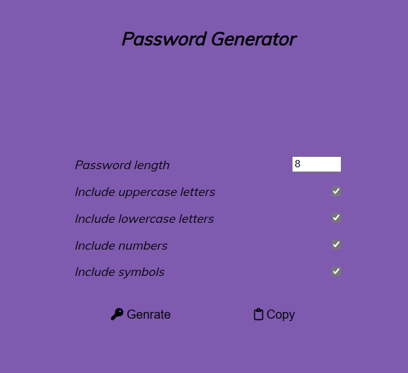

Certainly! Here's a README tailored to your project:

---

# Password Generator

This is a simple password generator project created using HTML, CSS, and JavaScript.

## Overview

This project aims to provide users with a convenient tool for generating secure passwords with various options for customization. By leveraging the `Math.random()` method, `Math.floor()` function, and character codes, the generator creates passwords comprising uppercase and lowercase letters, numbers, and symbols.

## Features

- **Customizable Password Length:** Users can specify the desired length of the generated password, ranging from 4 to 20 characters.
- **Flexible Character Options:** Users can choose to include or exclude uppercase letters, lowercase letters, numbers, and symbols in the generated passwords.
- **Copy to Clipboard:** The generated password can be easily copied to the clipboard with a single click for quick and convenient use.

## Usage

1. Open the `index.html` file in your web browser.
2. Adjust the password length and character type settings according to your preferences.
3. Click the "Generate" button to create a random password based on your chosen criteria.
4. To copy the generated password to the clipboard, click the "Copy" button.

